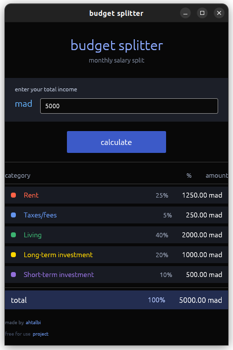

# Budget Splitter

A modern desktop application built with Rust and egui for splitting your income into fixed budget categories. This project was created to learn desktop application development, event loops, enums, lifetimes, and the egui/eframe framework.

## Logo


## Screenshot



## What This Project Does

Budget Splitter helps you divide your income into 5 fixed categories with predefined percentages:

- **Rent** - 25%
- **Taxes/Fees** - 5%
- **Living** - 40%
- **Long-term Investment** - 20%
- **Short-term Investment** - 10%

Simply enter your total income in MAD (Moroccan Dirham), and the app calculates exactly how much goes to each category.

## Why I Built This

I created this project because I needed a real tool I would actually use in my daily life to manage my budget. Instead of using generic apps, I wanted to build something custom that fits my specific needs.

More importantly, this project was a learning journey to understand:

- **Desktop Application Development** - How to build native GUI apps with Rust
- **Event Loop** - How egui/eframe handles events, rendering, and updates
- **Enums** - Using Rust enums to represent budget categories with associated data
- **Lifetimes** - Managing string references and ensuring memory safety
- **Traits** - Creating extensible interfaces for calculation and formatting
- **Architecture Patterns** - Facade pattern, separation of concerns, modular design

## Features

- Modern dark theme UI
- Real-time budget calculation
- Color-coded categories for easy visualization
- Full-width input field for quick entry
- Clickable footer links to GitHub
- Input validation (max 999999.99, no negative numbers)
- Window icon support

## Architecture

The project follows clean architecture principles:

```
src/
├── main.rs              # UI layer with egui
├── logo.png             # Application icon
├── savings-app.png      # Screenshot for README
└── calculator/
    ├── mod.rs           # Module declarations
    ├── types.rs         # BudgetCategory enum, BudgetLine, BudgetResult
    ├── traits.rs        # BudgetCalculator and BudgetFormatter traits
    ├── engine.rs        # BudgetEngine implementation
    └── facade.rs        # BudgetFacade for simple API
```

### Key Concepts Used

**Enums with Data:**
```rust
pub enum BudgetCategory {
    Rent,                    // 25%
    Taxes,                   // 5%
    Living,                  // 40%
    LongTermInvestment,      // 20%
    ShortTermInvestment,     // 10%
}
```

**Lifetimes:**
```rust
pub fn label(&self) -> &'static str {
    // Returns static string slices for category names
}
```

**Traits for Extensibility:**
```rust
pub trait BudgetCalculator {
    fn calculate(&self, total: f64) -> BudgetResult;
}

pub trait BudgetFormatter {
    fn format_breakdown(&self, result: &BudgetResult) -> Vec<String>;
}
```

**Facade Pattern:**
```rust
pub struct BudgetFacade {
    engine: BudgetEngine,
}

impl BudgetFacade {
    pub fn calculate(&self, total: f64) -> BudgetResult {
        self.engine.calculate(total)
    }
}
```

## Technologies Used

- **Rust** - Systems programming language
- **egui** - Immediate mode GUI library
- **eframe** - Framework for building egui applications
- **Cargo** - Package manager and build tool

## What I Learned

### 1. Desktop App Development
Building a desktop app is different from web development. You need to handle:
- Window management
- Event loops
- Rendering pipelines
- Platform-specific integrations

### 2. Event Loop
The event loop is the heart of any desktop application. In egui/eframe:
- The framework continuously polls for events (keyboard, mouse, window)
- Events are processed and translated into UI updates
- The UI is re-rendered every frame (typically 60 FPS)
- This immediate mode approach is different from traditional retained mode GUIs

### 3. Enums
Rust enums are powerful - they can hold data and methods:
```rust
impl BudgetCategory {
    pub fn percentage(&self) -> f64 {
        match self {
            BudgetCategory::Rent => 25.0,
            // ...
        }
    }
}
```

### 4. Lifetimes
Lifetimes ensure references are valid for as long as needed:
- `&'static str` for compile-time string literals
- Lifetime annotations in function signatures
- Understanding ownership and borrowing in UI code

### 5. Traits
Traits allow for flexible, extensible code:
- Define behavior that can be implemented by multiple types
- Enable polymorphism without inheritance
- Make code testable and maintainable

## Building and Running

```bash
# Install dependencies
cargo build

# Run the application
cargo run

# Build for release
cargo build --release
```

## Usage

1. Launch the application
2. Enter your total income in MAD
3. Click "Calculate" or press Enter
4. View your budget breakdown
5. Click on "ahtalbi" or "project" links to visit GitHub

## Input Limits

- Maximum value: 999,999.99 MAD
- Minimum value: Greater than 0
- Negative numbers are rejected

## License

Free for use. Feel free to modify and distribute.

## Author

Made by [ahtalbi](https://github.com/ahtalbi)

Project repository: [bank-savings-calculator](https://github.com/ahtalbi/bank-savings-calculator)

## Acknowledgments

This project was built as a learning experience with egui and eframe. Special thanks to the Rust community for excellent documentation and resources.

---

**Note:** This is a real tool I use daily to manage my budget. The fixed percentages work for my situation, but the code is structured so you can easily modify them to fit your needs.